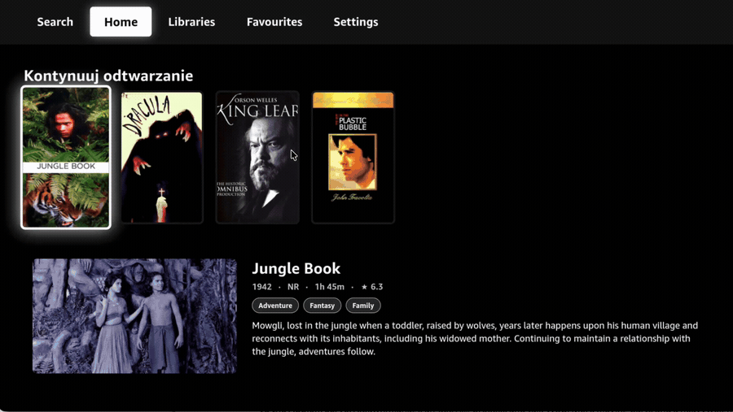
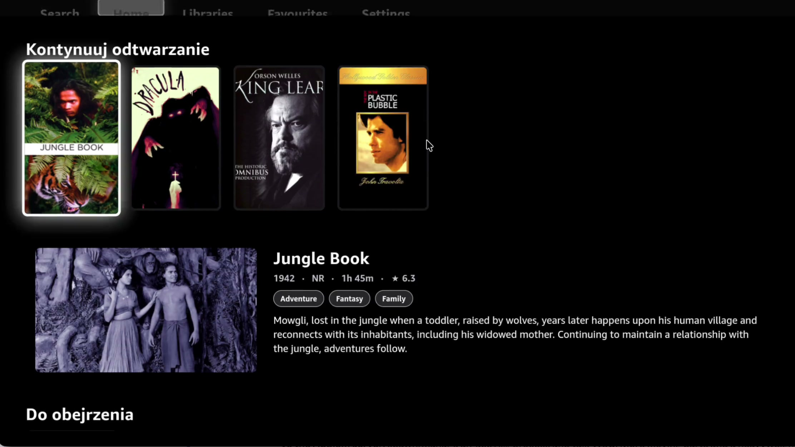
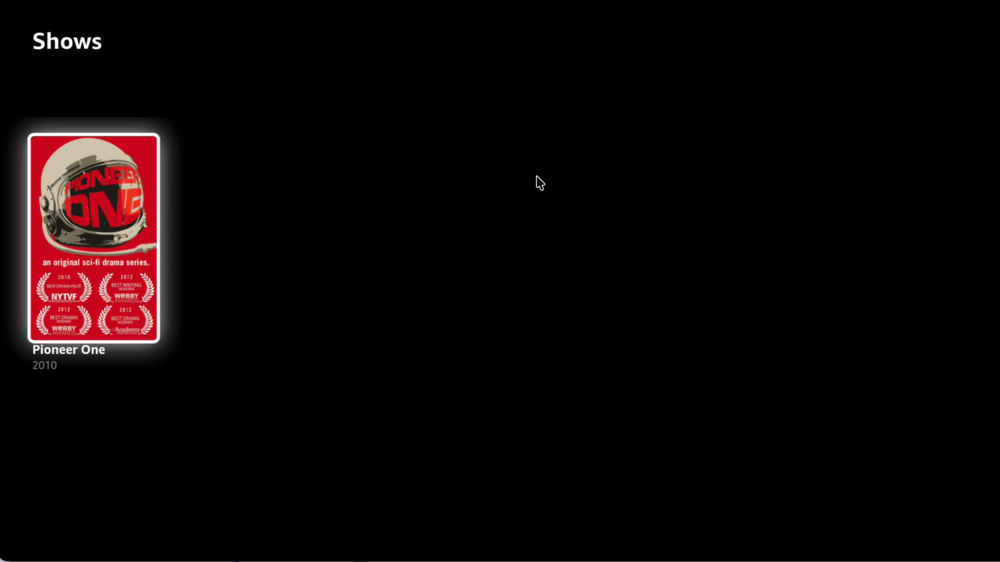
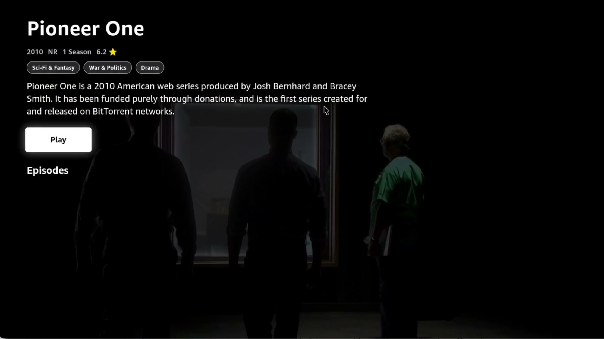
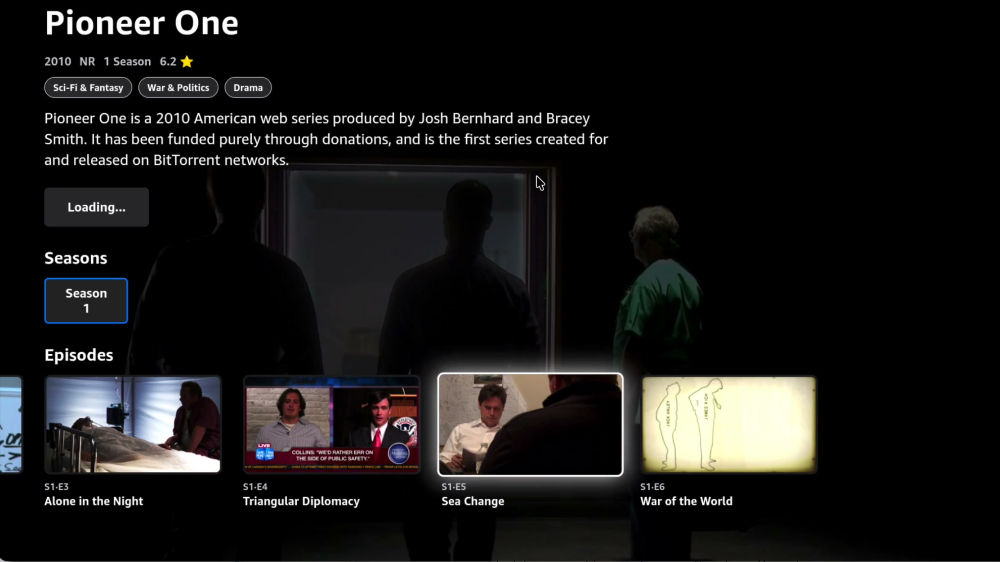
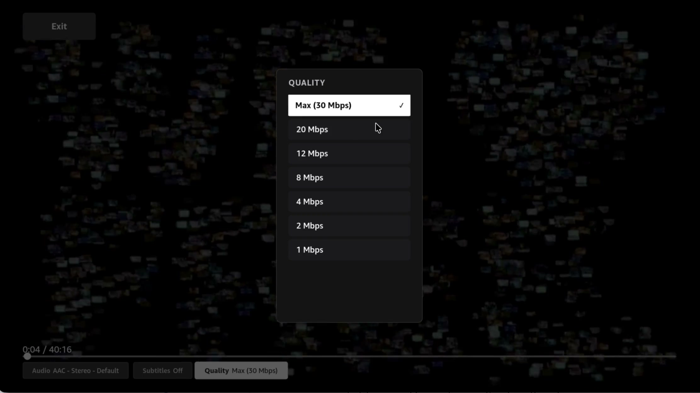

# Jellyfin for Fire TV (Vega OS)

[](https://reactnative.dev/)
[](https://developer.amazon.com/vega)
[](./LICENSE)

A native **[Jellyfin](https://jellyfin.org/) client for Amazon Fire TV (Vega OS)**, built with React Native and the Amazon Vega SDK. Browse your libraries, pick up where you left off, and stream with full D-pad navigation — including on‑the‑fly audio track, subtitle, and quality switching driven by Jellyfin's transcoding APIs.

It's built on top of the [react-native-multi-tv-app-sample](https://github.com/AmazonAppDev/react-native-multi-tv-app-sample) monorepo, so the UI layer is shared and the same screens can be ported to Android TV, Apple TV, and Web.

<p align="center">
  
</p>

## Screenshots

| Home — Continue Watching & dynamic info panel | Library grid |
| :---: | :---: |
|  |  |

| Title details & Play | Seasons & episodes |
| :---: | :---: |
|  |  |

| Player — audio / subtitle / quality controls |
| :---: |
|  |

## Features

- **Quick Connect login** — sign in by entering a short code in your Jellyfin web dashboard; the app polls and authenticates automatically, with the session persisted across launches.
- **Home rows** — *Continue Watching* (resume), *Next Up*, and *Latest* media, with a hero info panel that updates to the focused title (year, rating, runtime, genres, overview).
- **Libraries** — list all of your Jellyfin libraries and browse each as a responsive, TV‑optimized poster grid.
- **Movie & show details** — rich metadata, genre tags, ratings, and a Play action. Shows expand into seasons and per‑episode artwork.
- **Adaptive playback** — HLS streaming through Jellyfin's transcoder with:
  - **Audio track switching** (live re-init with the selected stream)
  - **Subtitle selection** (burned-in on demand, plus *off*)
  - **Quality / bitrate selection** (Max 30 Mbps down to 1 Mbps)
  - **Resume** from the last watched position
- **Fire TV remote & spatial navigation** — full D-pad focus management via [react-tv-space-navigation](https://github.com/bamlab/react-tv-space-navigation), with play/pause, 10s seek, and back handled natively.

## Project layout

This is a Yarn-workspaces monorepo. The Fire TV client lives in `apps/vega`; shared UI and the Jellyfin API client live in `packages/shared-ui`.

```
react-native-jellyfin-client/
├── apps/
│   ├── vega/                       # Fire TV (Vega OS) Jellyfin client  ← this app
│   │   └── src/
│   │       ├── screens/            # Login, Home, Libraries, Settings, player/
│   │       ├── components/         # HomeRow, MediaGrid, LibraryCard, VegaTopBar…
│   │       ├── services/jellyfin/  # auth storage
│   │       └── store/              # Redux auth slice
│   └── expo-multi-tv/              # Universal build (Android TV / Apple TV / Web)
├── packages/
│   └── shared-ui/
│       └── src/services/JellyfinClient.ts   # Jellyfin SDK wrapper (Quick Connect, libraries, items, streams, images)
├── streamyfin/                     # Reference Expo Jellyfin client (read-only)
└── package.json
```

## Getting started

### Prerequisites

- **Node.js** 18+
- **Yarn** 4.5
- **[Amazon Vega SDK](https://developer.amazon.com/docs/vega/0.21/install-vega-sdk.html)** with the `vega` CLI on your `PATH`
- A running **Jellyfin server** (or use the public demo server, which is the default)

### Install

```bash
git clone git@github.com:finloop/react-native-jellyfin-client.git
cd react-native-jellyfin-client
yarn install
```

### Point it at your server

The server URL is defined in [`packages/shared-ui/src/services/JellyfinClient.ts`](packages/shared-ui/src/services/JellyfinClient.ts):

```ts
export const SERVER_URL = 'https://demo.jellyfin.org/stable';
```

Replace it with your own server. **Do not include a trailing slash** — it's treated as a sub-path origin, and a trailing slash will produce malformed image/stream URLs (e.g. `stable//Items`).

### Run on Fire TV (Vega)

```bash
# 1. Start Metro
yarn dev:vega

# 2. In another terminal, start the virtual device + port forwarding
yarn dev:vega:device

# 3. Build, install, and launch
yarn build:vega          # Release build (use build:vega:debug for a debug build)
yarn dev:vega:install
yarn dev:vega:launch
```

On first launch, choose **Quick Connect**, then enter the displayed code in your Jellyfin server's dashboard (**Dashboard → Quick Connect**, or your user menu) to authorize the TV.

### Useful commands

| Command | Description |
| --- | --- |
| `yarn dev:vega` | Start the Vega Metro bundler |
| `yarn dev:vega:device` | Boot the virtual device & forward Metro port 8081 |
| `yarn build:vega` | Release build for Fire TV |
| `yarn build:vega:debug` | Debug build |
| `yarn dev:vega:install` | Install the built `.vpkg` on the device |
| `yarn dev:vega:launch` | Launch the installed app |
| `yarn lint:all` / `yarn typecheck` | Lint / typecheck all workspaces |

## Tech stack

| Technology | Purpose |
| --- | --- |
| React Native 0.81 | Core framework |
| Amazon Vega SDK (`@amazon-devices/*`) | Fire TV Vega OS runtime, navigation, media APIs |
| `@jellyfin/sdk` | Jellyfin API client |
| react-tv-space-navigation | D-pad / spatial focus management |
| Redux Toolkit | Auth session state |
| hls.js | HLS playback in the Vega player |

## Troubleshooting

- **Images or video don't load** → verify `SERVER_URL` has **no trailing slash** and is reachable from the device.
- **Quick Connect code never authorizes** → Quick Connect must be enabled on the server (Dashboard → Quick Connect), and the device and server must reach each other.
- **`vega` command not found** → install the Vega SDK and ensure `KEPLER_SDK_HOME` / the CLI is on your `PATH`.
- **Metro can't connect** → re-run `yarn dev:vega:device` to re-establish port forwarding.

## Acknowledgements

- [Jellyfin](https://jellyfin.org/) — the free software media system
- [react-native-multi-tv-app-sample](https://github.com/AmazonAppDev/react-native-multi-tv-app-sample) — the monorepo and shared TV UI this is built on
- [Streamyfin](https://github.com/fredrikburmester/streamyfin) — Expo Jellyfin client used as an implementation reference (in `streamyfin/`)

## License

Licensed under the MIT-0 License — see [LICENSE](./LICENSE).
